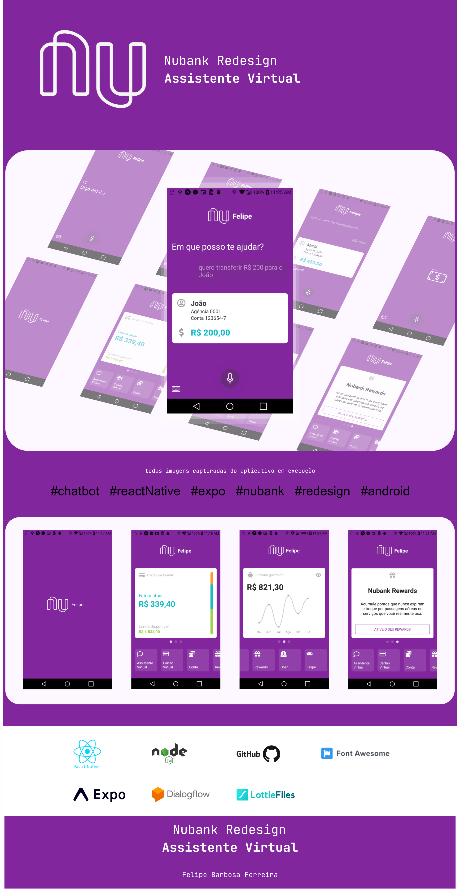
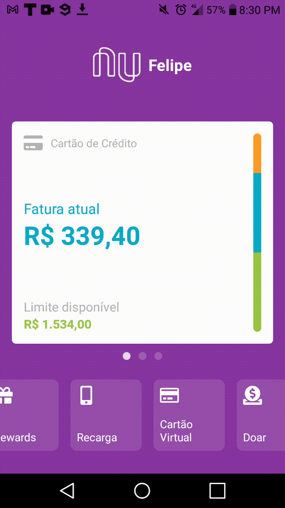

# Nubank Redesing
Projeto Nubank Redesign React Native

Agora com um Assistente Virtual, essa nova funcionalidade oferece outro nível de acessibilidade ao usuário. 

Introduzindo outro nível de comunicação digital, promova a acessibilidade de sua aplicação ;)


## Android & iOS


### Instalação
```
  Iniciando o projeto
    npm install -g expo-cli
    expo init nome_projeto
    expo start
    cd nome_projeto
    npm start # you can open iOS, Android, or web from here, or run them directly with the commands below.
     npm run android
     npm run ios # requires an iOS device or macOS for access to an iOS simulator
     npm run web
```
Utilize a variável de ambiente `BASE_URL_ASSISTANT` para definir a url do seu servidor backend. Por exemplo, no terminal inicie o projeto:

`BASE_URL_ASSISTANT="https://url.seu.server.com" expo start`

## Behance
https://www.behance.net/gallery/108239475/Nubank-Redesign-Assistente-Virtual



## Animações LottieFiles
* [Mic por Hicy Wonder](https://lottiefiles.com/643-aispeech-mic)
* [Money Transfer por Võ Quân](https://lottiefiles.com/7825-money-transfer)
* [Ripple por Igor Shadko](https://lottiefiles.com/3108-ripple)
* [Dot Preloader por Daniel Tremontini Santiago](https://lottiefiles.com/593-dot-preloader)

## Draggable Flat List



## #KeepRocking
* #fullstack
* #mobile
* #react
* #nodejs
* #chatbot